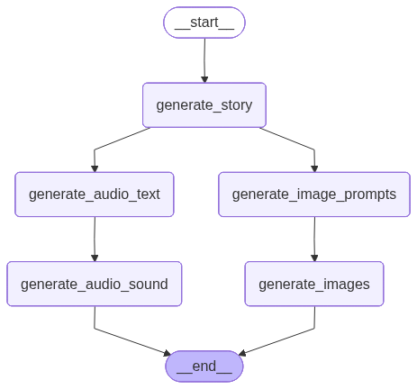

# AI-Powered Short-Form Video Generator

An intelligent content creation pipeline that leverages Large Language Models and generative AI to automatically produce engaging short-form videos from text prompts.

## Project Overview

This project demonstrates the practical application of modern AI technologies to automate the entire video production workflow—from ideation to final output. By orchestrating multiple AI models through LangGraph, the system generates cohesive, publication-ready videos complete with synchronized visuals, narration, and subtitles.

**Key Achievement:** Full video production at under $2 per video, showcasing efficient resource utilization and cost-effective AI integration.

## Key Features

- **Automated Story Generation:** Creates engaging narratives tailored to any topic
- **AI-Driven Visuals:** Generates contextually relevant images using state-of-the-art diffusion models
- **Natural Voice Synthesis:** Produces high-quality narration with text-to-speech technology
- **Intelligent Synchronization:** Automatically aligns audio, images, and subtitles with custom heuristics
- **Production-Ready Output:** Generates polished short-form videos suitable for social media platforms

## Architecture

The system is built on a **LangGraph Pipeline** that orchestrates multiple AI models in a sequential workflow:

1. **Content Planning:** LLM generates structured story outline
2. **Visual Creation:** Story segments converted into image generation prompts
3. **Asset Generation:** Parallel creation of images and audio narration
4. **Post-Production:** Custom Editor class synchronizes all media elements using speech-to-text alignment

### Workflow Visualization


### End effect visualization
[](https://github.com/user-attachments/assets/82db9008-beed-444b-aea5-4778d4256554)
## Technology Stack

| Component | Technology | Purpose |
|-----------|------------|---------|
| **Story Generation** | Gemini 2.5 Flash | Narrative creation & image prompt engineering |
| **Image Synthesis** | FAL AI Flux/Dev | High-quality visual generation |
| **Voice Synthesis** | FAL AI Orpheus TTS | Natural-sounding narration |
| **Subtitle Generation** | OpenAI Whisper (Small) | Speech recognition & text alignment |
| **Orchestration** | LangGraph | Workflow management & state handling |

## Technical Highlights

### Synchronization Challenge
The core technical challenge was achieving precise synchronization between audio, visuals, and subtitles. This was solved through:

- **Speech-to-Text Extraction:** Whisper model extracts timing data from generated audio
- **Chunk Alignment:** Custom heuristic maps text segments to corresponding images
- **Dynamic Timing:** Adaptive duration calculation ensures natural pacing

### State Management
All generated assets are serialized through a `GraphState` schema, ensuring type safety and enabling easy debugging and iteration.

## Cost Efficiency

Production cost breakdown per video:
- Image Generation (FAL AI): ~$0.80
- Text-to-Speech (FAL AI): ~$0.90
- Story Generation (Gemini): Negligible
- Speech Recognition (Whisper): Free (local)

**Total: < $2.00 per video**

## Getting Started

### Option 1: Docker (Recommended)

#### Set up `docker-compose.yml`
```bash
version: '3.8'

services:
  movie-generator:
    build: .
    environment:
      - TOPIC=${TOPIC:-Beautiful friendship story}
      - PLAYBACK_SPEED=${PLAYBACK_SPEED:-1.5}
      - TEST_MODE=${TEST_MODE:-false}
      - GEMINI_API_KEY={your key}
      - FAL_KEY={your key}

    volumes:
      # Output videos appear here on your computer!
      # bridge between local folder and outputted movies and serialized states
      - ./output:/app/src/data/videos
      - ./final_states:/app/src/data/final_states
```

After having `docker-compose` set up simply run:

```bash
docker-compose up
```

After this in the root of the project in the `output` directory you should get generated .mp4 file, with the short form content you can utlize.

### Option 2: Local Environment

```bash
# Create virtual environment
python3 -m venv venv
source venv/bin/activate

# Install dependencies
pip3 install -r requirements.txt
pip install -e .

# Run the application
python3 src/main.py
```

## Future Enhancements

- Multi-language support for global content creation
- Real-time preview and iteration
- Integration with social media APIs for direct publishing
- Cost Reduction for Images and Audio
- Fully automated AI-Agent for content creation, utlizing social media API connections

## Learning Outcomes

This project demonstrates proficiency in:
- **AI/ML Engineering:** Integration of multiple generative AI models
- **System Design:** Building robust, stateful workflows
- **Problem Solving:** Novel synchronization algorithms
- **Software Engineering:** Clean architecture with containerization

---

**Built with modern AI technologies to solve real-world content creation challenges.**
